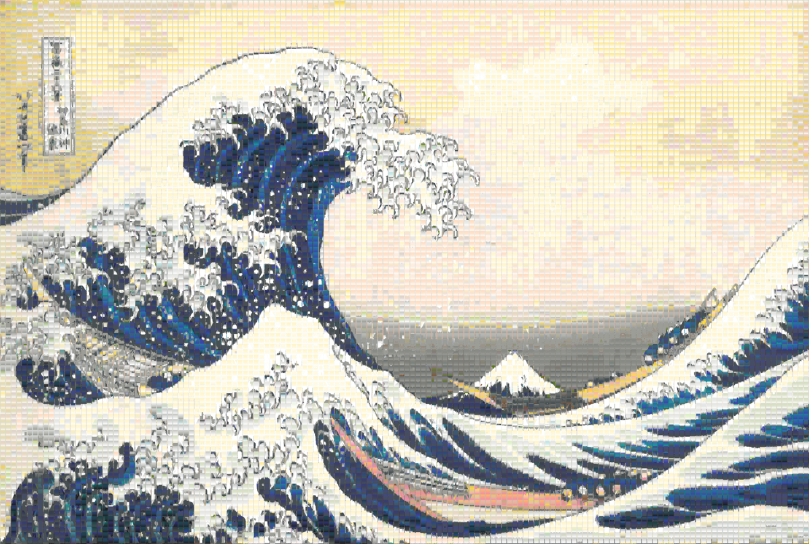

# bannerify

Approximate an image with a wall of Minecraft banners.

Give it an image and a wall size; it picks a base color and a stack of dyed
patterns for every banner, matches a background block for every wall
position, and writes **one self-contained HTML page** with an
original-vs-result comparison slider, a per-banner crafting guide, a
materials list, and downloadable `.schem` / `.litematic` schematics.



*"The Great Wave off Kanagawa" as a 100-row banner wall (15,000 banners).*

## Build

```sh
cargo build --release
```

The binary is `target/release/bannerify`. All assets (banner patterns,
block textures) are embedded — the binary is standalone. Windows and Linux
x86 builds target AVX2+FMA by default (any Intel/AMD CPU from ~2013 onwards);
build with `--features force-scalar` for older machines.

## Usage

```sh
bannerify input.jpg output.html --row 20
```

Size the wall with `--row N` **or** `--columns N` (blocks); the other axis
is inferred from the image's aspect ratio. The image is resized internally —
never scale it yourself.

Open `output.html` in a browser: drag the slider to compare against the
original, type a row/column into the crafting guide to get that banner's
pattern steps and a copy-pasteable `/give` command, and download the
schematics from the buttons at the top.

### Quality knobs

The defaults are a good speed/quality balance. For a nicer result:

```sh
bannerify input.jpg output.html --row 40 -p 3 4 2
```

- `-p, --perturbations TOP_N DUPLICATES ROUNDS` — random-restart search on
  top of the base solver. Big quality gain, costs roughly
  `TOP_N × DUPLICATES × ROUNDS` extra solves per banner. `3 4 2` is a
  solid setting.
- `-x, --exact-candidates N` — how many candidates each refinement step
  scores exactly, by perceptual (OKLab) distance, instead of by the cheap
  approximation (default `20`). Raise it for a slightly closer match,
  lower it (or `0`) for speed.
- `-F, --feature-weight λ` — how hard the solver is pulled towards clean
  flat colors and crisp edges (default `0.5`). Every banner is also fitted
  by an idealised two-layer banner in pure dye colors, and λ weighs that
  fit against the raw pixels. Raise it when logos and flat areas come out
  muddy, lower it (or `0`) for photographs.
- `-s, --seed N` — perturbation is deterministic per seed; try a few seeds
  and keep the best result.
- `-L, --layer-range MIN MAX` — how many pattern layers a banner may use
  (default `4 6`). More layers = closer match, more crafting steps.

### Layout

When the image's aspect ratio doesn't match the wall's:

- `--fit` *(default)* — scale up until the wall is covered; edges crop.
- `--stretch` — distort to fit exactly.
- `--fill COLOR` — letterbox with a color (`'#ff9453'`, `'9,4,87'`,
  `'rgb(114, 5, 14)'`).

### Excluding things

```sh
bannerify input.jpg output.html --row 20 -P globe,mojang -B beacon,ancient_debris
```

- `-P, --exclude-patterns` — banner pattern ids the solver may not use
  (e.g. patterns you can't craft).
- `-B, --exclude-blocks` — block ids the background matcher may not pick.

### Output extras

- `--preview PIXELS` — largest dimension of the images embedded in the
  HTML (default: the banner wall's size). Smaller = smaller HTML file.
- `--render PATH` — also write the full-resolution wall render to a PNG on
  disk (not embedded).

### Config file

Every option can live in a TOML file; command-line flags win:

```sh
bannerify input.jpg output.html --row 20 -f config.toml
```

See [`config.toml`](config.toml) in this repo for a commented example of
every key.

### Everything else

```sh
bannerify --help
```

`--debug` prints per-stage timings and peak memory if you're curious what
the time goes to. `-w N` caps the worker threads (default: all cores).
